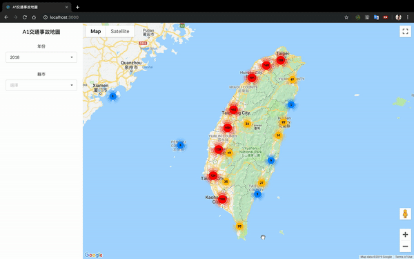

# Traffic Accident Map



在Google地圖中使用Marker及Marker Cluster標示出台灣每個地區的交通事故資料，包含發生時間、發生地址及事故狀況。

資料來源為[內政資料開放平臺-歷史交通事故資料](https://data.moi.gov.tw/MoiOD/Data/DataDetail.aspx?oid=67781E29-8AAD-46A9-A2C8-C3F339592C27)，原檔為CSV須事先匯入MongoDB。

Frontend
- React.js
- create-react-app

Backend
- Node.js
- Koa
- MongoDB
- Mongoose
- Nodemon

Third-party API
- Google Maps JavaScript API

``` bash
# Installation
$ npm install

# Runs the app in the development mode. 
$ npm start

# Builds the app for production to the `build` folder.  
$ npm run build

# Launch the Node.js server  
$ npm run start-server
```